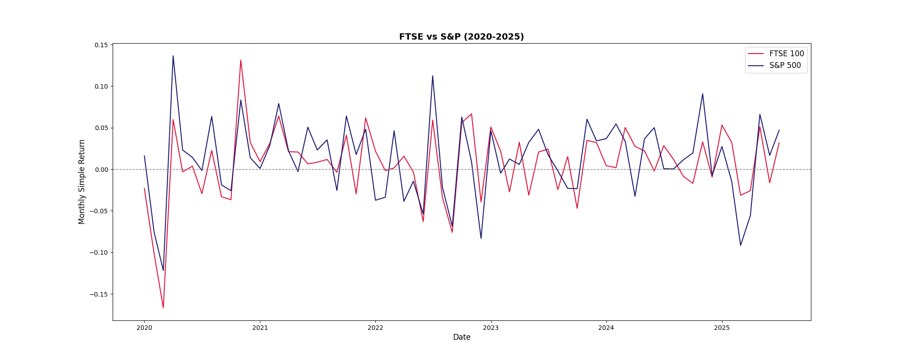

# FTSE-SP500-Returns-Analysis-2020-2025

## 📌 Project Overview

This project analyzes and visualizes the **monthly simple percentage returns** for two major global stock market indices: the **FTSE 100** (UK) and the **S&P 500** (US).

The analysis spans a period from **January 2020 to July 2025**, providing a comparative view of market performance during a period of high global volatility.

## 📊 Key Findings

The line chart clearly illustrates the return patterns of the two indices:

* **Subject Comparison:** The analysis compares the **S&P 500** (representing the 500 largest US companies) and the **FTSE 100** (representing the 100 largest UK companies).
* **High Volatility (S&P 500):** The S&P 500 (dark blue line) exhibited a **greater magnitude of swings** in monthly returns (both positive and negative) compared to the FTSE 100.
* **Correlation:** Both indices generally move in the same direction, indicating a high degree of correlation between the US and UK markets.
* **2025 Performance:** In the final months shown (2025), the S&P 500 generally registered **greater positive returns** than the FTSE 100 at the peak data points.

### Visualization

The resulting line chart showing the comparison of monthly returns:

## 🛠️ Technical Stack and Methodology

This project demonstrates data manipulation and visualization skills using Python.

| Category | Tool/Library | Purpose in Project |
| :--- | :--- | :--- |
| **Language** | Python 3 | Core scripting language. |
| **Data Handling** | `pandas` | Reading data from CSV, converting the `Date` column to datetime objects (see Cell 5), copying the DataFrame (Cell 3), and dropping the old `Date` column (Cell 9). |
| **Visualization** | `matplotlib` / `seaborn` | Creating the final line chart with a horizontal zero line, custom colors (`crimson` for FTSE 100, `midnightblue` for S&P 500), and appropriate axis labels (see Cell 17). |

## 💻 Code Steps from Jupyter Notebook

The key steps executed in the `ReturnValuesLineChart (1).ipynb` notebook are:

1.  **Load Data:** Read `monthly_returns_2020_to_2025.csv` into a pandas DataFrame (Cell 2).
2.  **Date Conversion:** Convert the initial `Date` column (as a string) to a `datetime` object in a new column called `new_date` (Cell 5).
3.  **Clean-up & Rename:** Drop the old string `Date` column (Cell 9) and rename the new `new_date` column back to 'Date' (Cell 13).
4.  **Plotting:** Generate the final line chart using `matplotlib`, applying a `seaborn` style, and saving the output as `Return_Values.png` (Cell 17).

---
*Inspired by coursework from **365 Careers***
